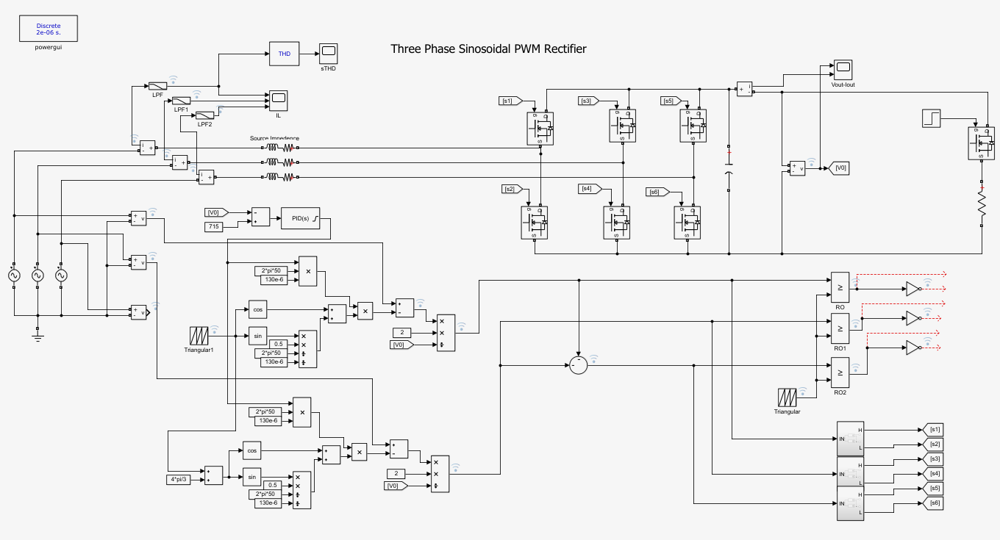
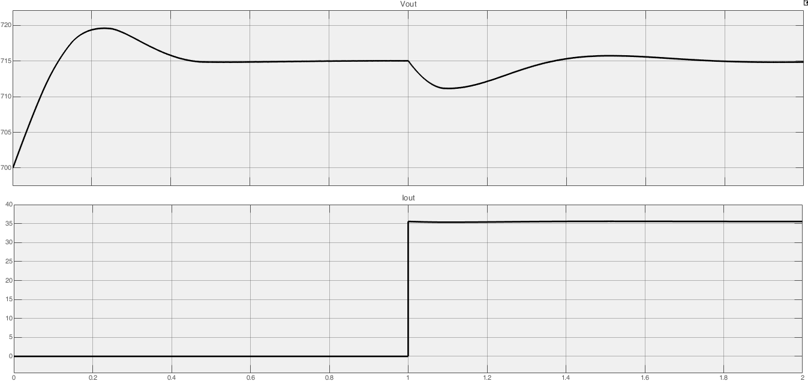
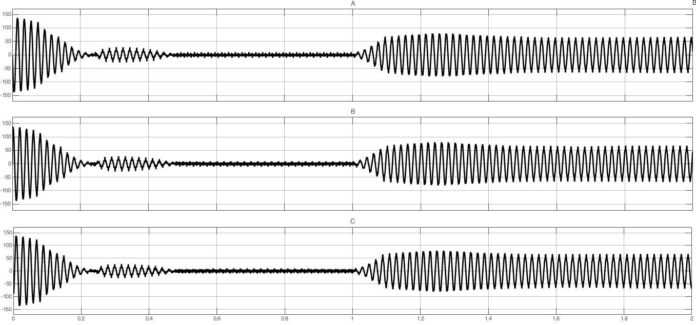

# PFController
PFC - power factor correction (controller). Firmware is intended to run as three-phase inverter with the load balancing.

## Folder structure

- `/models` folder contains Matlab 2018b+ Simulink model of the PFC
- `/firmware` folder contains a project in Keil uVision 5 for the STM32F7
- `/terminal_app` folder contains a project in Qt Creator 4+ with the control application

## Algorithm

The Matlab Simulink model is based on the ["Three Phase Sinosoidal PWM based Rectifier" by Syed Abdul Rahman Kashif](https://ww2.mathworks.cn/matlabcentral/fileexchange/28536-three-phase-sinosoidal-pwm-based-rectifier)
The control logic was changed, and additional processing has been added.

The device produces the constant (rectified) output voltage (700-800V) from three phase grid voltage 380V. The input current flow follows the shape of the voltage, thus the device imitates a linear load. Working in this way helps to reduce EMI and extends the lifespan of industrial networks.
The Total harmonic distortion (THD) is calculated to control the linearity of the load.

Fig.1. Simulink model

The current at each phase is created by means of IGBT half bridges which are controlled by a PWM signal. To calculate the shape of the PWM signal internal sinusoidal generator is used. The generator output is shifted and matches each voltage phase (`0`, `2*pi/3`, `4*pi/3`). Additional phase shift is added to take into acount the inductive nature of the circuit.
Then the different between the input voltage and the generator output is multiplied by the inflation factor. The inflation factor is calculated as an output of a PID controlled, which inputs are the current voltage at the output capacitor, and the desired output voltage.

As a result, the PWM signal for each phase represents the amount of power should be taken from the grid to charge the output capacitor (or to supply an output load).

The result of the model can be seen in Fig.2-3. The time interval 0..1s represents output capacitor charging. At 1s time a 20 Ohm load is connected to the output. 1..2s interval shows transition processes.

Fig.2. Voltage and current 

Fig.3. Input currents

## Firmware

The firmware v0.1.1 implement the PFC operation and a load control.

### Requirements

Keil uVision was used as a development IDE. The firmware was tested with the following software and toolckain versions:

> IDE-Version: µVision V5.28.0.0
> Toolchain: MDK-ARM Professional Version: 5.28.0.0
> C Compiler: V5.06 update 6 (build 750)

### Dependencies

- [ST AN2594 "Application note EEPROM emulation in STM32F10x microcontrollers"](http://www.st.com/web/en/resource/technical/document/application_note/CD00165693.pdf) was used, but the code was reworked
- STM32 peripheral library was used for hardware-level functions. Was generated by [STM32CubeMX](https://www.st.com/en/development-tools/stm32cubemx.html)
- CMSIS Cortex-M7 Core Peripheral Access Layer V4.30

### TODO

---
**NOTE**

The firmware is in the development. Using it without additional testing in a real network can be dangerous. The parameters and settings should be analysed and corrected for each hardware.

---

Future improvements to make:

- Add temperature measurement
- Add ventilators control
- Add locks for settings, ADC, PFC logic modules
- Add automatic start
- Add extra configuration from the panel (remove defines)
- Add phase rotation check

## Hardware

The firmware was tested on the development board for STM32F765 (with modifications) and on a custom hardware.
Changes should be made before portion to the different hardware. The hardware description is defined mostly in the `board_stm32f7.h` file.

## Control software

### Requirements

The project was developed in Qt Creator 4.9.0.
Qt 5.12.2 (MSVC 2017, 32 bit) framework was used.

### Dependencies

